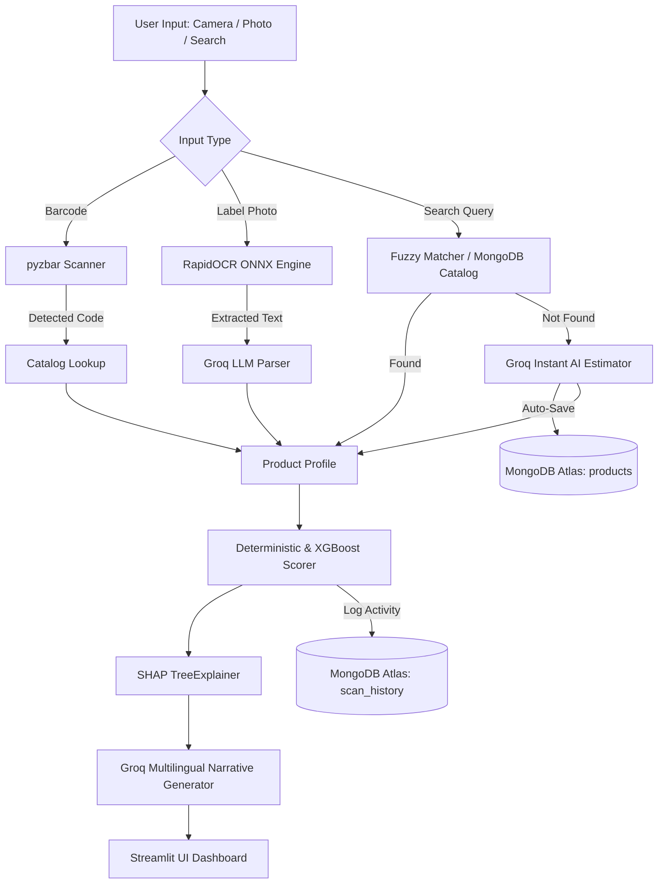

# 🌿 AAROGYA — AI Food Product Intelligence & Safety Scanner

> **B.Tech IT Final Year Project** | End-to-End Multilingual Food Safety Scoring, Computer Vision, Machine Learning, and Cloud Database System.

[](https://python.org)
[](https://xgboost.readthedocs.io)
[](https://groq.com)
[](https://streamlit.io)
[](https://github.com/RapidAI/RapidOCR)
[](https://www.mongodb.com/cloud/atlas)
[](#testing)

---

## 📌 Executive Summary

**AAROGYA** is an intelligent, real-time packaged-food safety analysis platform designed for Indian consumers. It combines computer vision, explainable AI (XGBoost + SHAP), high-speed LLM inference (Groq), and MongoDB Atlas cloud synchronization to empower users to understand what is inside their food.

Users can capture packaging with a camera, upload nutrition labels, search by name (with fuzzy misspelling tolerance), or analyze custom food items in real time. The platform provides transparent safety scoring (0–100), flags harmful additives, and recommends healthier, category-matched alternatives in **6 regional and international languages** (English, Hindi, Marathi, Gujarati, Tamil, and Spanish).

---

## 🚀 Key Features

### 1. 🌐 Multilingual Localization (6 Languages)
* **Real-time Language Switcher**: Switch the entire interface instantly between:
  - 🇬🇧 **English**
  - 🇮🇳 **हिन्दी (Hindi)**
  - 🇮🇳 **मराठी (Marathi)**
  - 🇮🇳 **ગુજરાતી (Gujarati)**
  - 🇮🇳 **தமிழ் (Tamil)**
  - 🇪🇸 **Español (Spanish)**
* **Localized AI Doctor Advice**: Groq AI generates clear, human-readable explanations directly in the selected language (e.g., natural Marathi or Hindi).

### 2. 🤖 RapidOCR + Groq AI Vision (Zero-Fail Pipeline)
* **Local ONNX Inference**: Utilizes `RapidOCR` for lightning-fast text extraction directly on the CPU without external binary dependencies or cloud vision model 404 errors.
* **Dual Scan Modes**:
  * **📦 Product & Nutrition Label**: Extracts calories, sugar, fat, saturated fat, protein, fiber, and sodium.
  * **📋 Ingredients List**: Detects ultra-processed markers, palm oil, artificial colors, preservatives, and allergens (INS 500, E471, MSG, etc.).

### 3. ☁️ MongoDB Atlas Cloud Synchronization
* **Cloud Database (`aarogya_db`)**:
  * **`products` collection**: Pre-seeded with 570+ food items, including popular Indian products (Maggi, Parle-G, Britannia, Kurkure, Lay's, Amul, etc.).
  * **`scan_history` collection**: Every scan across Camera, Vision, Upload, Search, and Demo is automatically persisted with timestamps and scores.
* **On-the-Fly Catalog Growth**: When a new custom product is analyzed using Groq AI, it is automatically upserted to MongoDB Atlas so subsequent searches find it immediately.

### 4. 🔍 Smart Search with Fuzzy Matching & Instant AI
* **Fuzzy Misspelling Tolerance**: Intelligently handles typos (e.g., `maggie`, `magi`, or `noodles` will surface `Maggi 2-Minute Masala Instant Noodles`).
* **"✨ Instant AI Analysis"**: For any food product not in the catalog (e.g., `Doritos`, `Red Bull`, `Amul Shrikhand`), clicking one button uses Groq AI to estimate nutrition facts, calculate the Aarogya score, highlight red flags, and save the item to MongoDB Atlas.

### 5. 🔬 Explainable Nutritional Scoring (0–100)
* **Deterministic Nutrition Algorithm (v1.0)**: Scores sugar, saturated fat, sodium, protein, fiber, energy density, and whole grains.
* **XGBoost Regressor ($R^2 = 0.955$)**: Trained on nutritional indicators with 5-fold cross-validation.
* **SHAP Explainability**: Identifies the primary positive and negative drivers behind every score.

---

## 🏗️ Architecture & Workflow



---

## 📁 Project Directory Structure

```
aarogya/
├── data/
│   ├── raw/
│   │   ├── aarogya_products_500.csv         # 500 generated products
│   │   └── aarogya_food_products_demo.csv    # 100 benchmark products
│   ├── generate_large_dataset.py            # Dataset synthesis generator
│   └── validate_dataset.py                  # 35-point dataset validation suite
│
├── database/
│   └── seed_mongodb.py                      # MongoDB Atlas seeder (570+ products)
│
├── ml/
│   ├── scoring.py                           # Deterministic nutrition algorithm (v1.0)
│   ├── features.py                          # 24-feature preprocessing pipeline
│   ├── train.py                             # XGBoost & Random Forest model training
│   ├── evaluate.py                          # Metric evaluation (MAE, RMSE, R²)
│   ├── explain.py                           # SHAP feature attribution
│   └── predict.py                           # Prediction service class
│
├── llm/
│   ├── groq_llm.py                          # Groq API client + RapidOCR vision parser
│   └── gemini.py                            # Gemini fallback client
│
├── recommendation/
│   └── recommender.py                       # Preference-weighted recommendation engine
│
├── utils/
│   ├── __init__.py
│   └── translations.py                      # 6-language translation dictionary & helper
│
├── api/
│   └── main.py                              # FastAPI REST endpoints (8 routes)
│
├── static/
│   └── demo/                                # High-res sample images for testing
│       ├── chocobite.jpg
│       ├── nutrioats.jpg
│       ├── masalachips.jpg
│       └── ingredients_chocobite.jpg
│
├── tests/
│   ├── test_scoring.py                      # 14 algorithmic scoring unit tests
│   ├── test_features.py                     # 10 feature engineering tests
│   └── test_recommender.py                  # 11 recommendation engine tests
│
├── app_simple.py                            # ⭐ Primary Presentation App (Multilingual + Mongo)
├── app_streamlit.py                         # Full Analytics & Comparison Dashboard
├── requirements.txt                         # Python dependencies
├── .env.example                             # Environment variable template
└── README.md                                # Project documentation
```

---

## 📊 Score Classification Tiers

| Score Range | Tier Verdict | Visual Indicator | Health Impact |
|:---:|:---:|:---:|---|
| **65 – 100** | **SAFE / HEALTHY** | 🟢 ✅ | Nutrient-rich, minimal processing, low free sugar & sodium |
| **40 – 64** | **MODERATE RISK** | 🟡 ⚠️ | Moderate nutritional value; consume in controlled portions |
| **0 – 39** | **HARMFUL / AVOID** | 🔴 ❌ | Ultra-processed, excessive added sugars, trans/saturated fats |

---

## 📈 Machine Learning Benchmarks

Three models were evaluated on the Indian packaged food dataset:

| Model | MAE | RMSE | $R^2$ Score | Status |
|---|:---:|:---:|:---:|:---:|
| Linear Regression (Baseline) | 1.01 | 1.31 | 0.991 | Overfitting baseline |
| Random Forest Regressor | 3.16 | 4.39 | 0.895 | Benchmark |
| **XGBoost Regressor (Primary)** | **2.00** | **2.86** | **0.955** | **Production Deployed** |

* **5-Fold Cross Validation**: $3.16 \pm 0.68$ MAE across diverse food categories.
* **Top Contributing SHAP Features**:
  1. Processing Level Penalty / NOVA Category
  2. Sugar content ($g / 100g$)
  3. Protein per calorie ratio
  4. Dietary Fiber ($g / 100g$)
  5. Sodium content ($mg / 100g$)

---

## 🛠️ Installation & Setup

### Prerequisites
* **Python 3.10 – 3.12**
* **Git**
* Free **Groq API Key** ([console.groq.com](https://console.groq.com))
* Free **MongoDB Atlas Cluster** ([mongodb.com/cloud/atlas](https://www.mongodb.com/cloud/atlas))

### Step 1: Clone and Virtual Environment Setup
```bash
git clone https://github.com/<your-username>/aarogya.git
cd aarogya

# Create virtual environment
python -m venv venv

# Activate virtual environment
# Windows (PowerShell):
.\venv\Scripts\Activate.ps1
# macOS / Linux:
# source venv/bin/activate

# Install dependencies
pip install -r requirements.txt
```

### Step 2: Configure Environment Variables
Create a `.env` file in the `aarogya/` directory:
```ini
# ── Groq API (High-Speed LLM Inference) ──────────────────────────────────────
GROQ_API_KEY=your_groq_api_key_here
GROQ_MODEL=groq/compound-mini

# ── MongoDB Atlas (Cloud Storage) ───────────────────────────────────────────
MONGO_URI=mongodb+srv://<username>:<password>@cluster0.your_cluster.mongodb.net/?appName=Cluster0
MONGO_DB_NAME=aarogya_db

# ── App Environment ─────────────────────────────────────────────────────────
APP_ENV=development
APP_DEBUG=true
SCORE_VERSION=v1.0
```

### Step 3: Seed MongoDB Atlas Database
Populate your MongoDB Atlas cluster with 570+ food items:
```bash
python database/seed_mongodb.py
```
*Output: `[OK] MongoDB seeded successfully! Products total: 572`*

### Step 4: Run Automated Test Suite
```bash
pytest tests/ -v
```
*Output: `40 passed in 2.14s`*

---

## 🖥️ Running the Application

### 1. Presentation App (Recommended for Demo)
Includes the animated splash screen, 6-language switcher, RapidOCR camera/label scanning, smart fuzzy search, and live MongoDB history:
```bash
streamlit run app_simple.py
```
> Access at: **`http://localhost:8501`**

### 2. Full Analytics Dashboard
Includes batch product comparisons, deep SHAP waterfall graphs, and personalized preference profiles:
```bash
streamlit run app_streamlit.py
```

### 3. FastAPI Backend Service (REST Endpoints)
```bash
uvicorn api.main:app --reload --port 8000
```
> Interactive API Documentation: **`http://localhost:8000/docs`**

---

## 🎯 Evaluator Presentation Demo Walkthrough

When presenting the project to examiners or judges, follow this sequence:

1. **Brand & Splash Screen**:
   - Open `http://localhost:8501`.
   - Observe the gradient animation and startup indicators.
2. **Multilingual Demo**:
   - In the top header, switch the language dropdown from **🇬🇧 English** to **🇮🇳 मराठी (Marathi)** or **🇮🇳 हिन्दी (Hindi)**.
   - Show how tabs, verdicts, metrics, and buttons localize automatically.
3. **Fuzzy Search & Indian Food Database**:
   - Go to the **🔍 Search** tab.
   - Type `maggie` (with a typo).
   - Observe the fuzzy matching engine surface **Maggi 2-Minute Masala Instant Noodles**.
   - Click **🔬 Scan** to reveal the score ($28/100$ - Harmful), high sodium warning ($1050mg$), and healthier whole-grain alternatives.
4. **On-the-Fly AI Intelligence**:
   - In Search, type an uncataloged product (e.g., `Doritos Cheese` or `Red Bull`).
   - Click **"✨ Analyze with Groq AI & Save to MongoDB"**.
   - Groq AI infers the ingredients, computes the score, flags additives, recommends alternatives, and persists the entry into MongoDB Atlas.
5. **Computer Vision & OCR**:
   - Switch to the **🤖 AI Vision** tab.
   - Click the **Ingredients List** demo.
   - RapidOCR reads the physical text locally in $< 500ms$, and Groq AI extracts ingredients and harmful red flags (Palm Oil, Emulsifiers, Excess Sugar).
6. **Cloud Persistence**:
   - Expand the **📊 Recent Scan History (MongoDB Atlas)** card at the bottom.
   - Show that all scans are saved in the cloud with timestamps.

---

## 🛡️ Medical & Academic Disclaimer

> **⚠️ Important Notice**: Aarogya is an academic engineering project developed for educational and comparative evaluation purposes. Nutritional scores are comparative indicators calculated from packaged labeling data and do not constitute clinical or medical advice. Users should consult qualified healthcare practitioners for specific dietary requirements.

---

## 👨‍💻 Contributors & Authors

* **Lead Developer & Researcher**: B.Tech Information Technology
* **Project**: AAROGYA Smart Food Intelligence Platform
* **Academic Year**: 2025 – 2026
